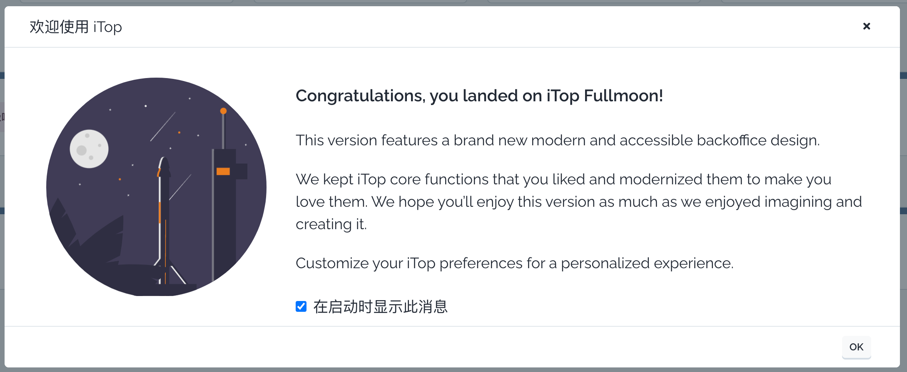

#### 登录界面

iTop的首界面是登录界面-- “欢迎使用 iTop!” 。每个iTop用户必须通过认证后，才能访问应用程序。

输入管理员给定的 **用户名** 和 **密码** ，并且点击 _**登录iTop**_.

>>  用户名通常是忽略大小写的，但是密码必须按照管理员给定的密码准确输入。

#### 首次连接到iTop

首次连接到iTop，将显示下方的欢迎对话框：

 跳过对话框并且下次连接到iTop时直接进入应用的主界面的话，勾选掉 **在启动时显示此消息** ，点击 **Ok** 按钮关闭对话框。

>> →下一篇： [主界面](../02-itop_main_screen/) 

---
原文：<https://www.itophub.io/wiki/page?id=3_0_0:user:connecting>

版本：3_0_0/user/connecting.txt · Last modified: 2022/01/21 16:52 (external edit)
