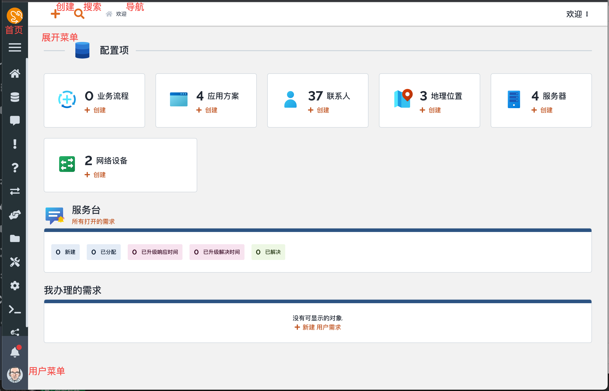
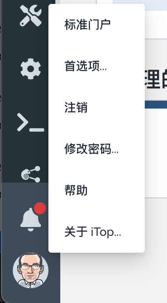
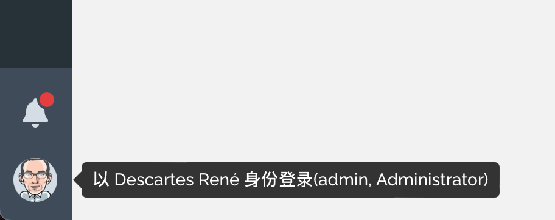
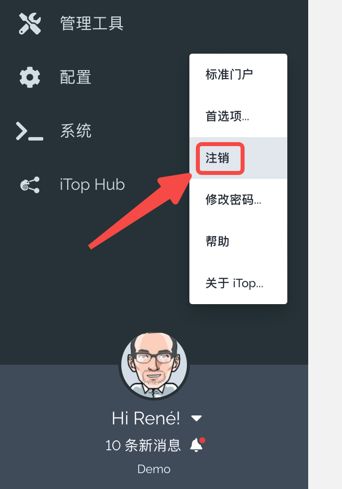
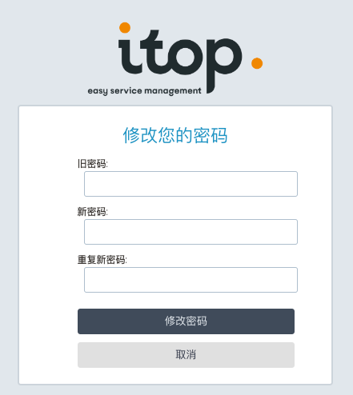
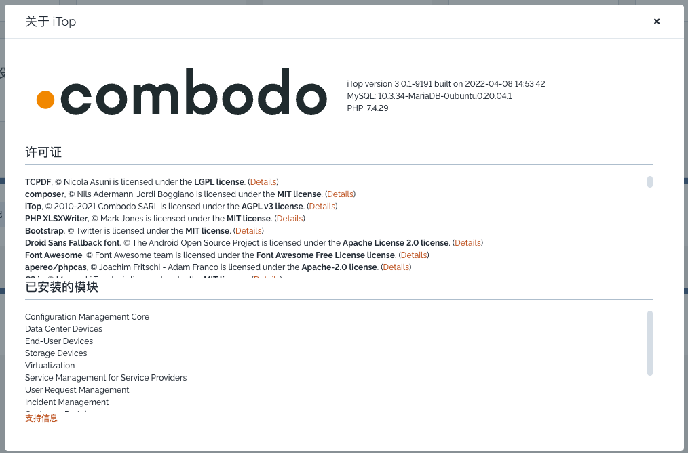
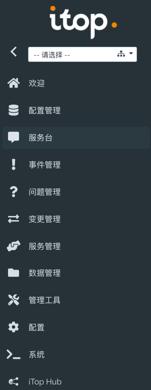
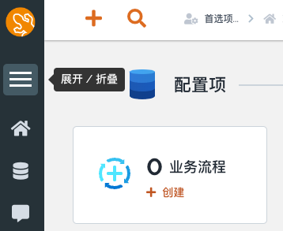
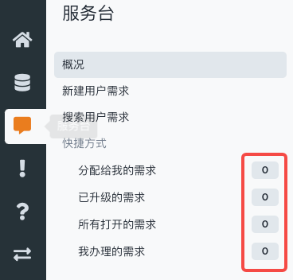
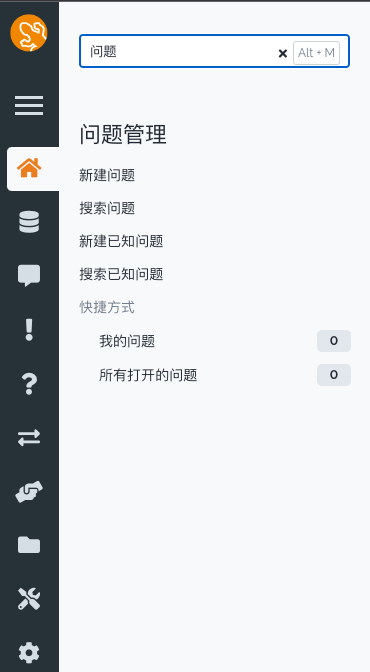

下图显示了应用程序的主界面，它包含了iTop界面的所有标准元素:

## **用户菜单**

在页面的左下方，通过点击 **用户** 图标可以访问弹出式菜单:

*   它显示关联的个人和连接用户的登录账号
*   如果用户是应用程序的管理员，也展示在该行中。

   
    

弹出式菜单提供了 **操作**. 点击它们将加载对应菜单项的操作。

*   **标准门户** 如果用户允许从这个控制台切换到门户，能看到提供的这个菜单。
    
    *   _如果iTop安装了其他的门户，并且对于当前用户可用，它们也将同时显示在这里。_
        
*   **首选项** 帮助用户管理在应用的首选项（语言、显示设置、快捷方式、关心的组织，等等）。
    
*   **注销** 终端iTop会话。
    
*   **修改密码** 变更iTop密码。
    
*   **帮助** 转向到iTop在线WIKI，仅在iTop Hub有效 (_假设用户可以访问互联网_)
    
*   **关于iTop** 显示iTop的安装版本。
    

### 标准门户
---------------

如何使用iTop用户门户，请查看 [《门户用户指南》](https://www.itophub.io/wiki/page?id=3_0_0:portal:portal_v2 "3_0_0:portal:portal_v2") ，这是另一个iTop界面，它是简化的，目标是作为自服务门户提供给客户和最终用户使用。

### 用户首选项
----------------

查看下一章： [管理首选项](https://www.itophub.io/wiki/page?id=3_0_0:user:user_preference "3_0_0:user:user_preference")

### 退出iTop
-----------------------

*   选择菜单
    
*   然后有一条确认消息，允许你重新连接

   

>>  另一种关闭iTop会话的方法是关闭web浏览器。注意，只关闭显示iTop页面的“选项卡”或窗口，但保持网页浏览器打开并不足以终止iTop会话。会话将一直保持打开，直到关闭最后一个窗口。

### 修改密码
----------------------

点击 **_修改密码_** 菜单选项，显示修改密码窗口：

*   在 **旧密码** 输入框输入 `旧密码`。
    
*   下一步, 在下面的 **新密码** 输入框，输入新密码。
    
    *   iTop管理员可以定义密码复杂度规则，
        
    *   默认要多于8个字符，至少包含一个数字、一个大写字母、一个小写字母和一个特殊字符。
        
    *   _复杂度规则仅仅检查新密码，所以旧密码可能并不满足规则。_
        
*   在第三个输入框重复输入新密码。
    
*   当完成后，点击 **_修改密码_** 确认修改。
    
>>  当使用外部机制进行iTop身份验证(如LDAP、Active Directory或单点登录身份验证)时， **更改密码** 菜单项不会显示。这种情况下，应该使用通常管理密码的方法。

### 关于 iTop
----------

显示了正在使用的iTop版本

## **菜单栏**

在屏幕左侧，一个扩展栏包含应用程序的**菜单**。这是大多数iTop功能的入口点。

菜单组包括图标，可以缩小到只显示图标，从而为有价值的信息腾出空间。

### 欢迎页
-------

快速回到iTop首页的方法！

* 在logo  上点击将带你返回到iTop首页，默认回到欢迎面板！

### 展开 & 折叠
-----------------

*   使用汉堡包图标  展开和折叠菜单的第一层。
    
*   当菜单栏展开后，分组的图标旁边显示了文字。
    
*   想要折叠菜单栏，点击  图标。
    
*   当菜单栏折叠时，如果过滤了某个组织，则会显示一个红色圆圈。
    
* * *

### 打开一个菜单组
----------------------

当单击菜单组图标或标题时，会打开二级菜单栏，包含该组的所有子菜单。对于预定义查询类型的子菜单，则显示查询返回的对象数量:

*   当结果低于100时，显示准确的对象数量，
    
*   否则显示 `99+` ，指示大于99，但考虑到性能原因，不执行确切的统计。
    

### 在菜单中搜索
---------------

也许你知道一个特定的子菜单标题，但你不记得它位于哪个图标/主菜单下。

*   点击 **任意** 菜单组，并且查看刚出现的列的顶部的灰色过滤区域
    
*   然后输入一些字符来过滤包含该字符串的菜单
    
*   输入**空格**，则显示**所有**菜单
    
*   选择菜单过滤列表中，你想要的那个
    
仅仅使用键盘实现这个功能的一个快捷方式是：

1.  在Chrome中，按下 `Alt+M` 在菜单中搜索，并不需要鼠标 (可以在的用户首选项设置中更改这个快捷键，比如它会与Firefox快捷键冲突。)
    
2.  输入要搜索菜单名称中的部分内容
    

* * *

### 组织
-------------

iTop中管理的许多对象都属于 _组织_ 。组织是iTop中编排对象的主要手段。例如，访问控制是基于组织的：一个给定的用户可能只被允许访问一组给定的组织。此外，菜单顶部的 **组织选择** 菜单允许最终用户将当前显示限制在给定组织的上下文中。一旦选择了一个组织，这个“上下文”信息就会在页面间传递。要重置上下文并再次显示所有iTop对象，只需在下拉列表中选择“所有组织”。

如果可能存在的所有组织列表太长(超过50个)，则下拉列表将被**自动补全**控件替换。在这种情况下，只需输入组织名称的至少三个字母即可选择。如果不确定名称，请使用**放大镜**图标搜索组织。

根据在iTop中的访问权限，可能无法访问某些组织。在这种情况下，下拉框中没有列出 _禁用_ 组织，也不能访问属于这些组织的对象。

有时需要缩短下拉框中显示的组织列表。例如，可能需要只查看感兴趣的客户。请参考 [首选项设置](../03-managing_your_preferences/) 了解关于如何配置列表的更多信息。

>> →下一篇：[首选项设置](../03-managing_your_preferences/) 

---
原文：<https://www.itophub.io/wiki/page?id=3_0_0:user:main>

版本：3_0_0/user/main.txt · Last modified: 2022/01/21 16:52 (external edit)

