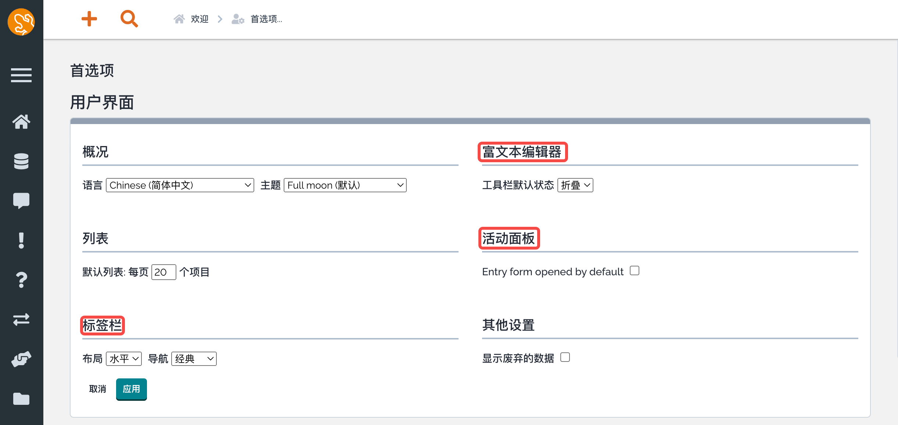

**首选项菜单** 允许每个用户去配置：

*   **用户界面** 选项，诸如语言、显示选项...
    
*   **关注的组织列表** 显示在 **上下文** 菜单中
    
*   **我的快捷方式** 由用户创建
    
*   **应用程序键盘快捷键**
    
 本页面中的所有的设置管理仅仅对当前用户生效。

_用户界面_ 包含了多个简单的设置：

### 语言
-----------------

允许你改变iTop的语言，

*   为此，从下拉列表中选择所需的语言，并单击 _应用_ 按钮。
*   所选语言用于翻译字段标签、菜单和提示消息。  
*   它不翻译存储在iTop的数据。

* * *

### 列表
-----

**默认长度** 用于限制每页显示的对象数量，例如在执行搜索时。

*   如果列表中的元素数量超过这个值，iTop将只显示对象的一个子集，其余的将分页系统。

*   每个页面默认配置显示 **默认长度** 数量的对象。
    
*   每页显示更多的对象可能更方便，但会减慢显示速度。

*   模板（dashlet）中保存的列表可以有自己的“长度”，独立于默认值，参见 [管理列表](../07-managing_lists) 。

*   此长度也用于限制CSV导入的历史(截断视图)。This length is also used to limit the history of CSV imports (truncated view).

修改这个默认值，变更数字然后点击 _应用_ 按钮。 

 该值是默认值，适用于没有特定配置的所有列表。(参见 [管理列表](../07-managing_lists) 了解如何配置特定列表)。

* * *

### 标签栏
----

 

 

这两个参数：布局和导航 控制对象的显示方式

*   **布局** 定义对象的标签标题显示的位置：如之前一样的 `水平` 和 对象显示左侧的 `垂直` 。
    
*   **导航** 定义如何从一个选项卡切换到另一个选项卡：`经典` 和以前一样，一次只显示一个选项卡， `可滚动` 所有选项卡都显示在同一页面，可以用鼠标滚动它们。可滚动模式不显示标签，这是耗时的，但只是一个图像，需要点击它来获得内容。

这些模式应用于iTop的所有对象上，同样编辑模式也是一样的。

* * *

### 富文本编辑器
----------------

 

此选项允许选择在每次编辑HTML字段时，工具栏是打开的。

* * *

### 活动面板
--------------

 

此选项指定在对象的详细信息中显示工单日志的方法

_一般而言是工单，但它适用于所有至少有一个工单日志的对象_

这两个可能的模式是：

*   你能够添加一个记录，但是首先点击这个图标！

*   可以直接在工单日志中输入内容并发送 (_默认记录模式是打开的_).
    

* * *

### 其他设置
--------------

*   选项 **显示废弃的数据** 默认不勾选，允许在下拉列表和搜索结果中显示废弃的对象
    

* * *

### 快速访问
----------------------

在大型公司中，并不是所有的用户都对记录在iTop中的所有组织感兴趣，例如，如果一个给定的用户只为一组给定的客户工作。这个设置让每个用户都可以定制出现在iTop页面左上角上下文菜单中的组织列表，以简化应用程序中的导航。

* * *

### 快捷方式
---------
    
使用此选项可重命名或删除用户创建的快捷方式。

*   参见[用户快捷方式](../08-shortcuts)了解如何创建快捷方式。

*   快捷方式会直接显示在 **欢迎** 菜单下面的主菜单中。

*   要重命名快捷方式，请选中名称前的复选框，然后单击 **重命名** 。

*   要删除快捷方式，请选中名称前的复选框，然后单击 **删除** (弹出确认消息)。

* * *

### 键盘快捷键
------------------------------

 

如果喜欢用键盘快速导航，我们为频繁的操作添加了快捷方式。

*   设置的默认快捷键可能与您的浏览器、操作系统的快捷键冲突，可以更改它们。

    1. 点击钢笔图标，

    2. 然后按下想要在键盘上设置的快捷键，就完成了。

    3. 结果显示为按下的键，作为更改的反馈确认。

    4. 如果你改变了主意，从第一步开始。

你可以在互联网上查看现有的 [最流行的web应用程序的快捷方式](https://shortcutworld.com/Platform/web "https://shortcutworld.com/Platform/web")。

* * *

### 用户的默认头像
----------------------

可以用来关联一个头像到您的用户。

如果你的联系人有照片，那么就会使用它。

>> →下一篇：[对象显示和修改](../04-display_and_modification_of_an_object/) 

---
原文：<https://www.itophub.io/wiki/page?id=3_0_0:user:user_preference>

版本：3_0_0/user/user_preference.txt · Last modified: 2022/01/21 16:52 (external edit)